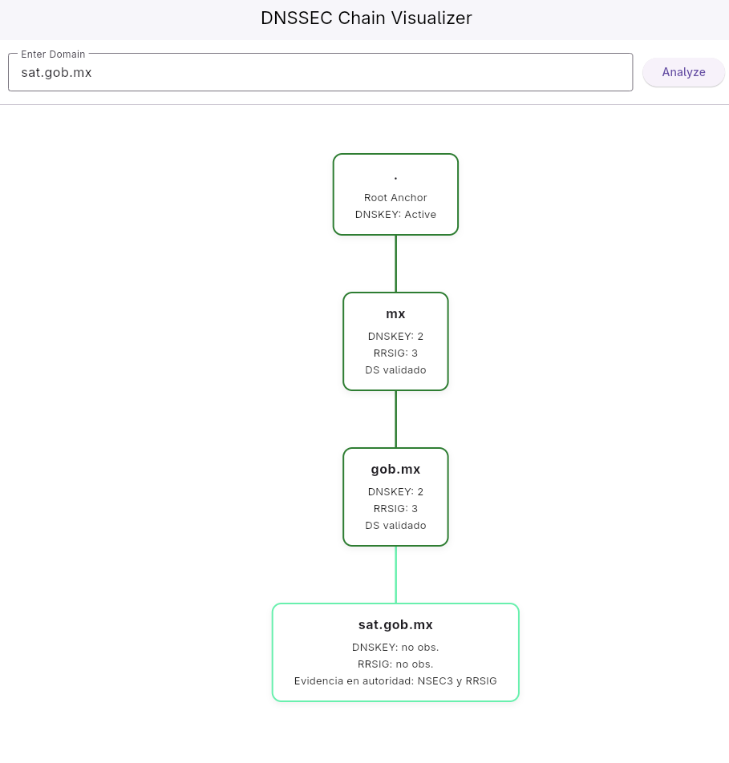
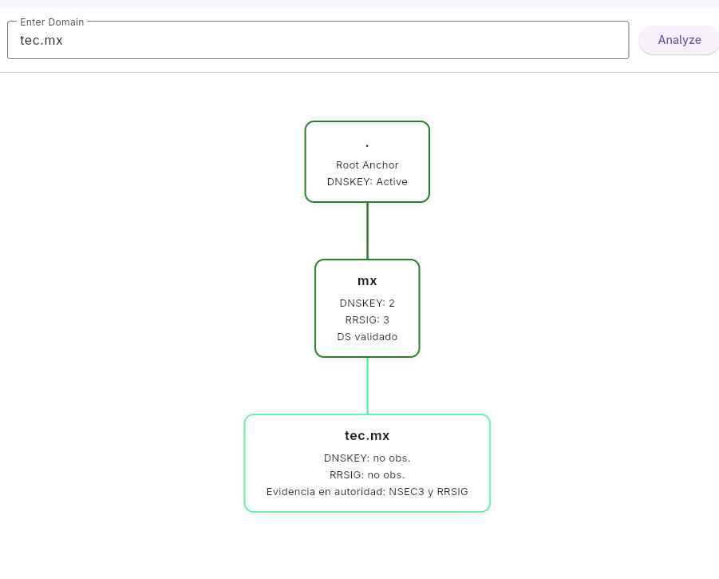
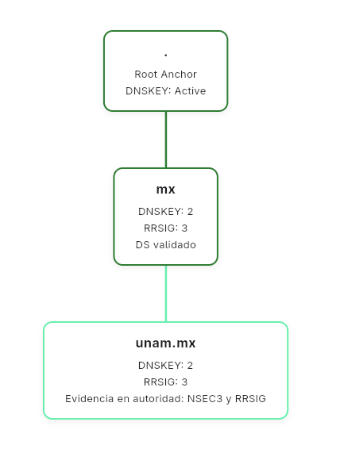
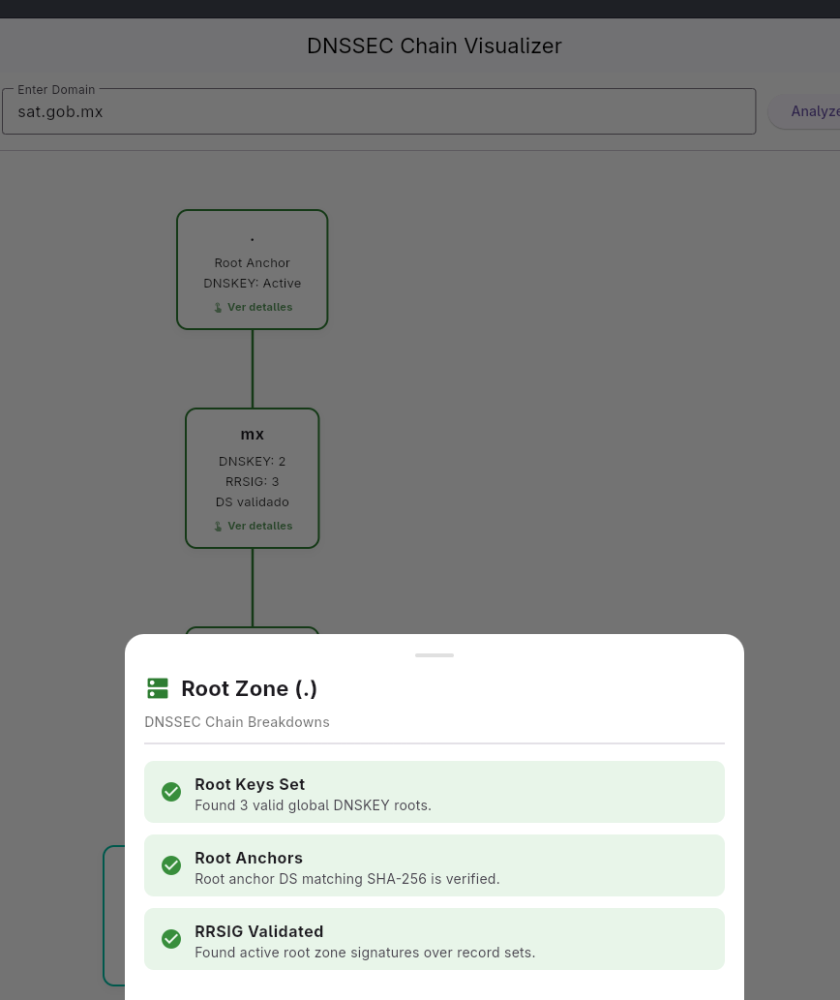
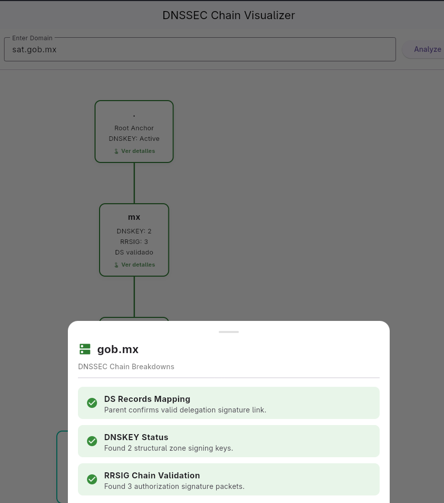
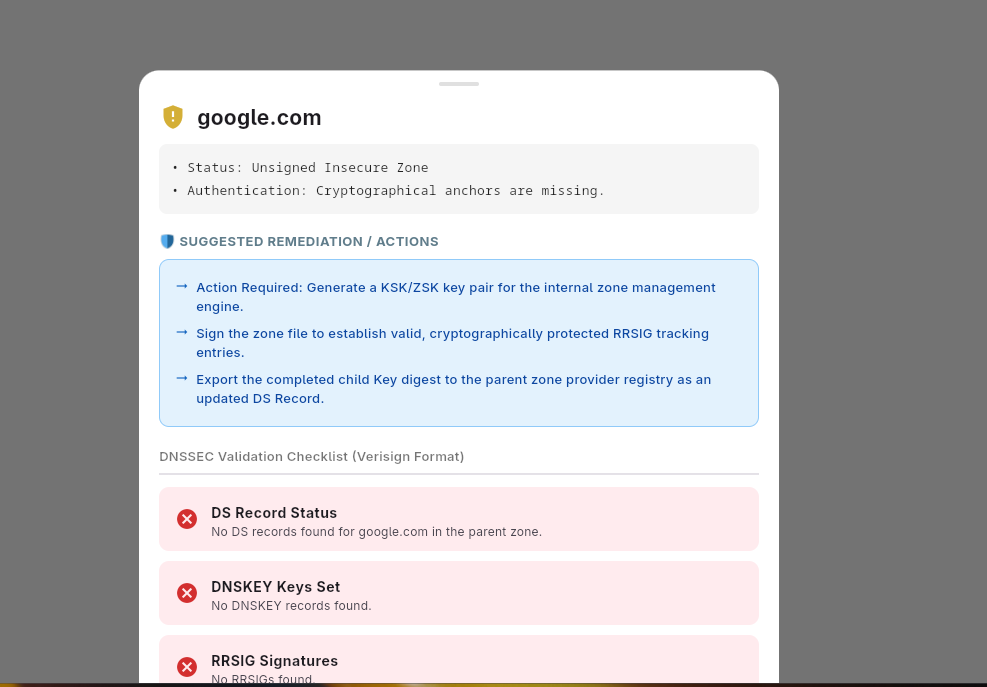
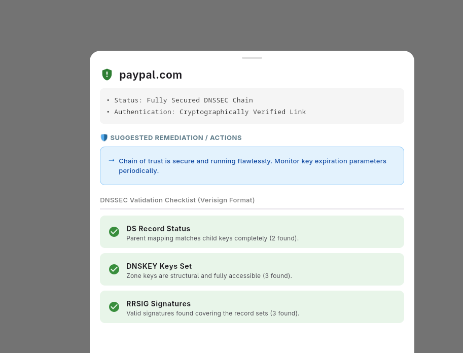
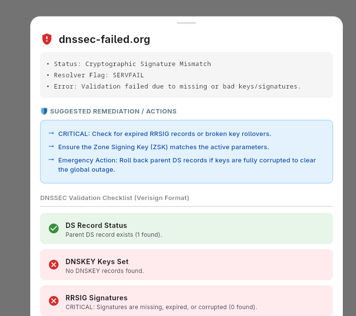

# DNSTREE Visualizer 🌲

A high-performance, interactive network diagnostic mini-app built with Flutter that transforms raw cryptographic DNSSEC validation data into an intuitive, hierarchical tree map.

## Supported Platforms 🖥️

- **Windows** (Native Client)
- **Linux** (Native Client)
- _Note: Designed using an ecosystem strategy akin to modern Dart/Swift paradigms, allowing universal portability across desktop clients._

---

## How It Works (The Architecture) ⚙️

Instead of running low-level terminal inquiries that are easily blocked by restrictive campus or corporate firewalls, DNSTREE utilizes **Asynchronous Parallelism** and **DNS-over-HTTPS (DoH)** to map the global chain of trust.

1.  **Domain Chain Splitting:** The engine takes a target domain (e.g., `google.com.mx`) and dynamically fragments it into its structural layers from the global root down to the authoritative child apex (`.` ➡️ `mx` ➡️ `com.mx` ➡️ `google.com.mx`).
2.  **Concurrent Batch Querying:** For every single layer discovered, the application fires off multiple non-blocking, asynchronous HTTP requests simultaneously to secure public resolver endpoints. It explicitly passes the `&do=true` (DNSSEC OK) flag to request raw cryptographic evidence (`DNSKEY`, `DS`, and `A` records).
3.  **The Parser & State Machine:** The application intercepts the incoming JSON payloads, reads the status codes, and evaluates the `AD` (Authenticated Data) header flags to compute the cryptographic validity of each zone.
4.  **Network Fallback Pipeline:** To ensure 100% uptime in high-security environments, the app features a dual-layer network fallback. If direct API calls are blocked or intercepted by a firewall, the application transparently reroutes traffic through an open CORS reverse-proxy to fetch the required diagnostic payloads.

---

## Visual Status Key 🎨

The visual tree utilizes a dynamic traffic-light status framework to provide immediate diagnostic insights:

- 🟢 **Green (Secure):** DNSSEC is fully deployed and mathematically validated. The `AD` flag is `true`, proving an unbroken chain of trust straight from the global root anchor. The zone is immune to DNS spoofing.
- 🟡 **Yellow (Insecure Boundary):** The domain resolves normally but has **not** enabled DNSSEC. No cryptographic keys or parent `DS` records exist. The chain safely terminates at an unsigned boundary (a strategic choice used by giants like `google.com` to optimize global query speeds).
- 🔴 **Red (Bogus / Broken):** Security is configured but deeply broken (returning a `SERVFAIL` status). This indicates an active Man-in-the-Middle attack or a severe administrative configuration failure (such as expired signatures or mismatched key roll-overs). Access is blocked to protect the client.
- ⚪ **Gray (NXDOMAIN):** The requested domain does not exist on the global ledger. The app leverages signed `NSEC/NSEC3` gap records to mathematically prove the non-existence of the domain.

---

## Screenshots 📸

### Core Tree Visualizations





### Clickable Layer Visualizers




### Dynamic Remediation Recommendations

The application provides contextual, interactive recommendations depending on the health and configuration of the selected node.





---

## Getting Started 🚀

### Disclaimer

As it was made in the programming language dart, source code must be compiled in each operating system that it may be used. As of now, there are only two platforms in which the app works; Windows and Linux. Other platforms may or may not be supported as it is not been yet tested.

### Prerequisites

Ensure you have the Flutter SDK installed and configured for your target desktop operating system:

```bash
flutter doctor
```

